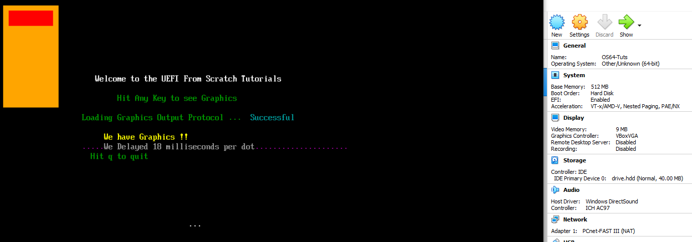
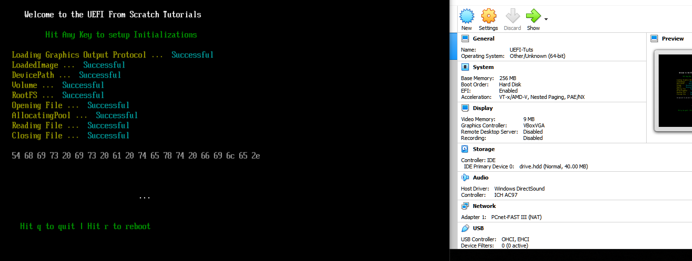

# Step by Step Tutorials on how to use the UEFI for OS Development from scratch

  
  
  
  

# NOTES  
- THE TUTORIALS ON YOUTUBE ARE WINDOWS BASED, BUT CODE SHOULD WORK IN LINUX AND MAC. 

- **UEFI 2.9 Specs PDF** : https://uefi.org/specifications  

- **NOTICE** : The 40 meg file is still there, and can now be used by MAC and Linux users. The 256 meg file is in the ZIP inside of the HOLD folder for those who want a larger drive.hdd file to play with. All Operating System users CAN use that size file too.  

- **The IMAGECREATOR program has been removed.**  

# BUILD INSTRCUTIONS  
[https://github.com/ThatOSDev/UEFI-Tuts/tree/master/BUILD.md](https://github.com/ThatOSDev/UEFI-Tuts/tree/master/BUILD.md)  

# SOCIAL MEDIA LINK
**YOUTUBE** : https://www.youtube.com/channel/UCouyC9D6WFBwc24sqdkS-jw  

# READ THIS !!!
- THINGS YOU SHOULD KNOW BEFORE STARTING OS DEVELOPMENT  
    - The C Language  
    - Assembly Language  
    - How to read Hex Code ( Example : 0x8664 )  
    - How your Host Operating System works ( Such as windows or linux )  
    - How your compiler works ( Such as GCC )  
    - How to do research ( Don't be lazy )  
- **BEGINNER MISTAKES** : [https://wiki.osdev.org/Beginner_Mistakes](https://wiki.osdev.org/Beginner_Mistakes)  

# TUTORIALS
- RIGHT CLICK THE LINKS AND OPEN IN NEW TAB  
    - TEXT &nbsp; &nbsp; &nbsp; &nbsp; &nbsp;&nbsp; &nbsp; &nbsp; &nbsp; &nbsp; &nbsp; &nbsp; &nbsp; &nbsp; &nbsp; &nbsp; &nbsp; &nbsp; &nbsp; &nbsp; &nbsp; &nbsp; &nbsp;&nbsp; &nbsp; &nbsp; &nbsp; &nbsp; &nbsp; &nbsp; &nbsp; &nbsp; &nbsp; &nbsp; &nbsp; &nbsp; &nbsp; &nbsp; &nbsp; &nbsp; &nbsp; &nbsp; &nbsp; --- [YOUTUBE&nbsp;&nbsp; 3](https://www.youtube.com/watch?v=vo1Q2th7l3I)  ---  [SOURCE CODE](https://github.com/ThatOSDev/UEFI-Tuts/tree/master/src/tutorial%201)  
    - COLOR &nbsp; &nbsp; &nbsp;&nbsp; &nbsp; &nbsp; &nbsp; &nbsp; &nbsp; &nbsp; &nbsp; &nbsp; &nbsp; &nbsp; &nbsp; &nbsp; &nbsp; &nbsp; &nbsp; &nbsp; &nbsp;&nbsp; &nbsp; &nbsp; &nbsp; &nbsp; &nbsp; &nbsp; &nbsp; &nbsp; &nbsp; &nbsp; &nbsp; &nbsp; &nbsp; &nbsp; &nbsp; &nbsp; &nbsp; &nbsp; &nbsp; --- [YOUTUBE&nbsp;&nbsp; 5](https://www.youtube.com/watch?v=MlJCHIgGj4g)  ---  [SOURCE CODE](https://github.com/ThatOSDev/UEFI-Tuts/tree/master/src/tutorial%202)  
    - KEYBOARD &nbsp; &nbsp; &nbsp; &nbsp; &nbsp; &nbsp; &nbsp; &nbsp; &nbsp; &nbsp; &nbsp; &nbsp; &nbsp; &nbsp; &nbsp; &nbsp; &nbsp; &nbsp;&nbsp; &nbsp; &nbsp; &nbsp; &nbsp; &nbsp; &nbsp; &nbsp; &nbsp; &nbsp; &nbsp; &nbsp;&nbsp; &nbsp; &nbsp; &nbsp; &nbsp; &nbsp; &nbsp; &nbsp; --- [YOUTUBE&nbsp;&nbsp; 6](https://www.youtube.com/watch?v=27xFmX0RK8s)  ---  [SOURCE CODE](https://github.com/ThatOSDev/UEFI-Tuts/tree/master/src/tutorial%203)  
    - ERROR CHECKING &nbsp; &nbsp;&nbsp; &nbsp; &nbsp; &nbsp; &nbsp; &nbsp; &nbsp; &nbsp; &nbsp; &nbsp; &nbsp; &nbsp; &nbsp; &nbsp; &nbsp; &nbsp; &nbsp; &nbsp; &nbsp; &nbsp; &nbsp; &nbsp; &nbsp; &nbsp; &nbsp; &nbsp; &nbsp; &nbsp;&nbsp; &nbsp; --- [YOUTUBE&nbsp;&nbsp; 7](https://www.youtube.com/watch?v=lLb_Chaf8zk)  ---  [SOURCE CODE](https://github.com/ThatOSDev/UEFI-Tuts/tree/master/src/tutorial%204)  
    - EFILIBS &nbsp; &nbsp; &nbsp; &nbsp; &nbsp; &nbsp; &nbsp; &nbsp; &nbsp; &nbsp; &nbsp; &nbsp; &nbsp; &nbsp; &nbsp; &nbsp; &nbsp; &nbsp; &nbsp; &nbsp; &nbsp; &nbsp; &nbsp; &nbsp; &nbsp; &nbsp; &nbsp; &nbsp; &nbsp; &nbsp; &nbsp; &nbsp; &nbsp; &nbsp; &nbsp; &nbsp; &nbsp; &nbsp; &nbsp; &nbsp; --- [YOUTUBE&nbsp;&nbsp; 8](https://www.youtube.com/watch?v=6YN18i6Ws18)  ---  [SOURCE CODE](https://github.com/ThatOSDev/UEFI-Tuts/tree/master/src/tutorial%205) 
    - CURSOR POSITIONS &nbsp; &nbsp; &nbsp; &nbsp; &nbsp; &nbsp; &nbsp; &nbsp; &nbsp; &nbsp; &nbsp; &nbsp; &nbsp; &nbsp; &nbsp; &nbsp; &nbsp; &nbsp; &nbsp; &nbsp; &nbsp; &nbsp; &nbsp; &nbsp; &nbsp; &nbsp; &nbsp; &nbsp; &nbsp; --- [YOUTUBE 10](https://www.youtube.com/watch?v=H-pzGdDZDKA)  ---  [SOURCE CODE](https://github.com/ThatOSDev/UEFI-Tuts/tree/master/src/tutorial%206) 
    - GRAPHICS OUTPUT 1 &nbsp; &nbsp; &nbsp; &nbsp; &nbsp; &nbsp; &nbsp; &nbsp; &nbsp; &nbsp; &nbsp; &nbsp; &nbsp; &nbsp; &nbsp; &nbsp; &nbsp; &nbsp; &nbsp; &nbsp; &nbsp; &nbsp; &nbsp; &nbsp; &nbsp; &nbsp; &nbsp; &nbsp; --- [YOUTUBE 11](https://www.youtube.com/watch?v=eypFh_k86BM)  ---  [SOURCE CODE](https://github.com/ThatOSDev/UEFI-Tuts/tree/master/src/tutorial%207)
    - EFI STALL / DELAY &nbsp; &nbsp; &nbsp; &nbsp; &nbsp; &nbsp; &nbsp; &nbsp; &nbsp; &nbsp; &nbsp; &nbsp; &nbsp; &nbsp; &nbsp; &nbsp; &nbsp; &nbsp; &nbsp; &nbsp; &nbsp; &nbsp; &nbsp; &nbsp; &nbsp; &nbsp; &nbsp; &nbsp; &nbsp; &nbsp; &nbsp; --- [YOUTUBE 12](https://www.youtube.com/watch?v=hMTGmX4_mUY)  ---  [SOURCE CODE](https://github.com/ThatOSDev/UEFI-Tuts/tree/master/src/tutorial%208)    
    - COLD REBOOT / SHUTDOWN &nbsp;&nbsp;&nbsp; &nbsp;&nbsp; &nbsp; &nbsp; &nbsp; &nbsp; &nbsp; &nbsp; &nbsp; &nbsp; &nbsp; &nbsp; &nbsp; &nbsp; &nbsp; &nbsp; &nbsp; &nbsp; &nbsp; &nbsp; --- [YOUTUBE 13](https://www.youtube.com/watch?v=JXxgnGzUFqQ)  ---  [SOURCE CODE](https://github.com/ThatOSDev/UEFI-Tuts/tree/master/src/tutorial%209)  
    - UNICODE KeyStroke ( UnicodeChar ) &nbsp; &nbsp; &nbsp; &nbsp; &nbsp; &nbsp; &nbsp; &nbsp; &nbsp; &nbsp; &nbsp; &nbsp; &nbsp; &nbsp; &nbsp; &nbsp; --- [YOUTUBE 14](https://www.youtube.com/watch?v=a4NJCuvfaPc)  ---  [SOURCE CODE](https://github.com/ThatOSDev/UEFI-Tuts/tree/master/src/tutorial%2010)
    - LOAD / OPEN / CLOSE VOLUME + FILE SYSTEM + FILES &nbsp; --- [YOUTUBE 15](https://www.youtube.com/watch?v=Zgiyy0Ysh08)  ---  [SOURCE CODE](https://github.com/ThatOSDev/UEFI-Tuts/tree/master/src/tutorial%2011)  
    - LOADED FILE TO BUFFER + READING IT &nbsp; &nbsp;&nbsp; &nbsp; &nbsp; &nbsp; &nbsp; &nbsp; &nbsp; &nbsp; &nbsp; &nbsp; &nbsp; &nbsp; --- [YOUTUBE 16](https://www.youtube.com/watch?v=rgDN0kTP-fY)  ---  [SOURCE CODE](https://github.com/ThatOSDev/UEFI-Tuts/tree/master/src/tutorial%2012)
    - CUSTOM FONT &nbsp; &nbsp; &nbsp; &nbsp; &nbsp; &nbsp; &nbsp; &nbsp; &nbsp; &nbsp; &nbsp; &nbsp; &nbsp; &nbsp; &nbsp; &nbsp; &nbsp; &nbsp; &nbsp; &nbsp; &nbsp; &nbsp; &nbsp; &nbsp; &nbsp; &nbsp; &nbsp; &nbsp; &nbsp; &nbsp; &nbsp; &nbsp; &nbsp;--- [YOUTUBE 17](https://www.youtube.com/watch?v=9YGmVDYyEVw)  ---  [SOURCE CODE](https://github.com/ThatOSDev/UEFI-Tuts/tree/master/src/tutorial%2013)
	- RETURN VALUE FROM FILE &nbsp; &nbsp; &nbsp; &nbsp; &nbsp; &nbsp; &nbsp; &nbsp; &nbsp; &nbsp; &nbsp; &nbsp; &nbsp; &nbsp; &nbsp; &nbsp; &nbsp; &nbsp; &nbsp; &nbsp; &nbsp; &nbsp; &nbsp; &nbsp;--- [YOUTUBE 18](https://www.youtube.com/watch?v=Ocvse6DGv3U)  ---  [SOURCE CODE](https://github.com/ThatOSDev/UEFI-Tuts/tree/master/src/tutorial%2014)
	- MEMORY MAP &nbsp;&nbsp; &nbsp; &nbsp; &nbsp; &nbsp; &nbsp; &nbsp; &nbsp; &nbsp; &nbsp; &nbsp; &nbsp; &nbsp; &nbsp; &nbsp; &nbsp; &nbsp; &nbsp; &nbsp; &nbsp; &nbsp; &nbsp; &nbsp; &nbsp; &nbsp; &nbsp; &nbsp; &nbsp; &nbsp; &nbsp; &nbsp; &nbsp; &nbsp;--- [YOUTUBE 19](https://www.youtube.com/watch?v=dw5YKZkHY-U)  ---  [SOURCE CODE](https://github.com/ThatOSDev/UEFI-Tuts/tree/master/src/tutorial%2015)
	- GRAPHICS OUTPUT 2 &nbsp; &nbsp; &nbsp; &nbsp; &nbsp; &nbsp; &nbsp; &nbsp; &nbsp; &nbsp; &nbsp; &nbsp; &nbsp; &nbsp; &nbsp; &nbsp; &nbsp; &nbsp; &nbsp; &nbsp; &nbsp; &nbsp; &nbsp; &nbsp; &nbsp; &nbsp; &nbsp; &nbsp; --- [YOUTUBE 20](https://www.youtube.com/watch?v=pYF0vlCDITc)  ---  [SOURCE CODE](https://github.com/ThatOSDev/UEFI-Tuts/tree/master/src/tutorial%2016)
	- CREATE & WRITE TO FILE &nbsp; &nbsp; &nbsp; &nbsp; &nbsp; &nbsp; &nbsp; &nbsp; &nbsp; &nbsp; &nbsp; &nbsp; &nbsp; &nbsp; &nbsp; &nbsp; &nbsp; &nbsp; &nbsp; &nbsp; &nbsp; &nbsp; &nbsp; &nbsp; &nbsp; --- [YOUTUBE 21](https://www.youtube.com/watch?v=_It1OboMmtw)  ---  [SOURCE CODE](https://github.com/ThatOSDev/UEFI-Tuts/tree/master/src/tutorial%2017)
	- CREATE & DELETE FOLDER &nbsp; &nbsp; &nbsp; &nbsp; &nbsp; &nbsp; &nbsp; &nbsp; &nbsp; &nbsp; &nbsp; &nbsp; &nbsp; &nbsp; &nbsp; &nbsp; &nbsp; &nbsp; &nbsp; &nbsp; &nbsp; &nbsp; &nbsp; &nbsp; --- [YOUTUBE 22](https://www.youtube.com/watch?v=mDc_KtOQPas)  ---  [SOURCE CODE](https://github.com/ThatOSDev/UEFI-Tuts/tree/master/src/tutorial%2018)
	- GET FILE SIZE &nbsp; &nbsp; &nbsp;&nbsp; &nbsp; &nbsp; &nbsp; &nbsp; &nbsp; &nbsp; &nbsp; &nbsp; &nbsp; &nbsp; &nbsp; &nbsp; &nbsp; &nbsp; &nbsp; &nbsp; &nbsp; &nbsp; &nbsp; &nbsp; &nbsp; &nbsp; &nbsp; &nbsp; &nbsp; &nbsp; &nbsp; &nbsp; &nbsp; &nbsp; &nbsp; --- [YOUTUBE 23](https://www.youtube.com/watch?v=qNu4TSPuUDg)  ---  [SOURCE CODE](https://github.com/ThatOSDev/UEFI-Tuts/tree/master/src/tutorial%2019)
	- ADDING THATCLIB &nbsp; &nbsp; &nbsp; &nbsp; &nbsp; &nbsp; &nbsp; &nbsp; &nbsp; &nbsp; &nbsp; &nbsp; &nbsp; &nbsp; &nbsp; &nbsp; &nbsp; &nbsp; &nbsp; &nbsp; &nbsp; &nbsp; &nbsp; &nbsp; &nbsp; &nbsp; &nbsp; &nbsp; &nbsp; &nbsp; --- [YOUTUBE 24](https://www.youtube.com/watch?v=hmXwtUZpbsc)  ---  [SOURCE CODE](https://github.com/ThatOSDev/UEFI-Tuts/tree/master/src/tutorial%2020)
	- PRINTF PART 1 &nbsp; &nbsp; &nbsp; &nbsp; &nbsp; &nbsp; &nbsp; &nbsp; &nbsp; &nbsp; &nbsp; &nbsp; &nbsp; &nbsp; &nbsp; &nbsp; &nbsp; &nbsp; &nbsp; &nbsp; &nbsp; &nbsp; &nbsp; &nbsp; &nbsp; &nbsp; &nbsp; &nbsp; &nbsp; &nbsp; &nbsp; &nbsp; &nbsp; --- [YOUTUBE 25](https://www.youtube.com/watch?v=CEtqrcNtAoM)  ---  [SOURCE CODE](https://github.com/ThatOSDev/UEFI-Tuts/tree/master/src/tutorial%2021)
	- JUMPING TO LOADER &nbsp;&nbsp; &nbsp; &nbsp; &nbsp; &nbsp; &nbsp; &nbsp; &nbsp; &nbsp; &nbsp; &nbsp; &nbsp; &nbsp; &nbsp; &nbsp; &nbsp; &nbsp; &nbsp; &nbsp; &nbsp; &nbsp; &nbsp; &nbsp; &nbsp; &nbsp; &nbsp; &nbsp; --- [YOUTUBE 26](https://www.youtube.com/watch?v=4xIyoNgCWYM)  ---  [SOURCE CODE](https://github.com/ThatOSDev/UEFI-Tuts/tree/master/src/tutorial%2022)
	- CODE CLEANUP &nbsp; &nbsp; &nbsp; &nbsp; &nbsp; &nbsp; &nbsp; &nbsp; &nbsp; &nbsp; &nbsp; &nbsp; &nbsp; &nbsp; &nbsp; &nbsp; &nbsp; &nbsp; &nbsp; &nbsp; &nbsp; &nbsp; &nbsp; &nbsp; &nbsp; &nbsp; &nbsp; &nbsp; &nbsp; &nbsp; &nbsp; &nbsp; --- [YOUTUBE 27](https://www.youtube.com/watch?v=4UFO1Um6Uo0)  ---  [SOURCE CODE](https://github.com/ThatOSDev/UEFI-Tuts/tree/master/src/tutorial%2023)  
	- EXITBOOTSERVICES &nbsp; &nbsp; &nbsp; &nbsp; &nbsp; &nbsp; &nbsp; &nbsp; &nbsp; &nbsp; &nbsp; &nbsp; &nbsp; &nbsp; &nbsp; &nbsp; &nbsp; &nbsp; &nbsp; &nbsp; &nbsp; &nbsp; &nbsp; &nbsp; &nbsp; &nbsp; &nbsp; &nbsp; &nbsp; --- [YOUTUBE 28](https://www.youtube.com/watch?v=EghNm2dDF8c)  ---  [SOURCE CODE](https://github.com/ThatOSDev/UEFI-Tuts/tree/master/src/tutorial%2024)
	- DYNAMIC ENTRY POINT (8664/ELF) &nbsp; &nbsp; &nbsp; &nbsp; &nbsp; &nbsp; &nbsp; &nbsp; &nbsp; &nbsp; &nbsp; &nbsp; &nbsp; &nbsp; &nbsp; &nbsp; --- [YOUTUBE 29]  ---  [SOURCE CODE](https://github.com/ThatOSDev/UEFI-Tuts/tree/master/src/tutorial%2025)

More Tuts Coming soon... ( **NOTE : The order of this list is subject to change** )  

	* Query Supported Resolutions  
	* Change Resolution  
	* Reading Raw Sectors from Drive  
	* Writing Raw Sectors to Drive  
	* Print String Part 2  
	* PCI  
	* Get File Info	 
	* Format and Partition drive with the EFI Environment  
	* Operating System Installation with just the EFI Environment  

  

  

  

  

  

  

  
